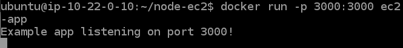

# Docker-Image-of-Node-Js-App
<h1>Node Js Setup</h1>
<ul><li>sudo apt update
</li>
<li>sudo apt install nodejs
</li>
<li>sudo apt install npm
</li></ul>
<h1Docker Setup Setup</h1>
<ul><li>sudo apt install docker.io
</li>
<li>sudo chmod 666 /var/run/docker.sock
</li>
</ul>
<h1>Node Js Application</h1>
<ul><li>mkdir node-ec2
</li>
<li> cd node-ec2
</li>
<li> npm init
</li>
<li>sudo nano package.json</li>

Add "start": "node index.js", in package.json and exit

<li>npm install express --save</li>
{
  "name": "app",
  "version": "1.0.0",
  "description": "",
  "main": "index.js",
  "scripts": {
    "start": "node index.js"
  },
  "author": "",
  "license": "ISC",
  "dependencies": {
    "express": "^4.17.1"
  }
}

Add in package.json

<li>sudo nano index.js</li>

const express = require('express');
const app = express();
const port = 3000;

app.get('/status', (req, res) => res.send({status: "I'm alive!"}));

app.listen(port, () => console.log(`Example app listening on port ${port}!`));

Add in index.js

<li>npm start</li></ul>
<h1>Docker Image</h1>
<ul>
<li>sudo nano Dockerfile and add following</li>

FROM node:13-alpine

WORKDIR /usr/src/app

COPY package*.json ./

RUN npm install

COPY . .

EXPOSE 3000
CMD [ "node", "index.js" ]

<li>docker build . -t ec2-app</li>
<li> docker run -p 3000:3000 ec2-app</li>

</ul>
<h1>Result</h1>
